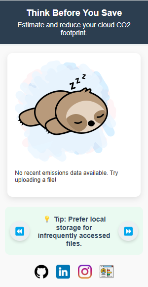
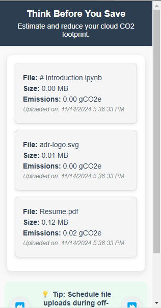
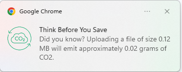

# Think Before You Save

**Think Before You Save** is a Chrome extension that calculates and displays the CO2 emissions associated with storing files on the cloud. It helps users make informed decisions to reduce their carbon footprint.

This project is part of the **Green Waves Hackathon** at **TU Delft University**, aiming to promote sustainable digital practices and raise awareness about the environmental impact of cloud storage.

---

## Features

- **File Emissions Estimation**: Calculate the CO2 emissions based on file size when uploading to the cloud.
- **History Tracking**: Maintain a history of uploaded files with their size, CO2 emissions, and upload date.
- **Interactive Tips**: Display rotating eco-friendly tips to promote sustainable cloud storage practices.
- **Notifications**: Notify users with insights about the environmental impact of file uploads.

---

## Screenshots

### Main Interface


### History View


### Notification View


---

## Installation

### From GitHub
1. Clone this repository to your local machine:
   ```bash
   git clone https://github.com/adam-bouafia/Think-Before-You-Save.git
   ```
2. Open Chrome and navigate to `chrome://extensions/`.
3. Enable **Developer mode** (top-right corner).
4. Click on **Load unpacked** and select the project directory.

---

## Usage

1. Click on the **Think Before You Save** icon in the Chrome toolbar.
2. Upload a file to see the calculated CO2 emissions and its details.
3. View the history of previous uploads, including file size, emissions, and upload date.
4. Read eco-friendly tips to adopt sustainable cloud storage habits.

---

## Technologies Used

- **JavaScript**: Core logic for extension functionality.
- **Chrome Extensions API**: For storage, notifications, and messaging.
- **@tgwf/co2**: Library for estimating CO2 emissions.
- **HTML/CSS**: User interface.

---

## Project Structure

```
Think-Before-You-Save/
├── background.js       # Handles emissions calculation and notifications
├── content.js          # Observes and processes file input events
├── popup.html          # Main interface for the extension
├── popup.js            # Logic for the popup UI
├── popup.css           # Styling for the popup
├── manifest.json       # Chrome extension configuration
├── package.json        # Project dependencies and metadata
├── webpack.config.js   # Webpack configuration (if applicable)
├── icons/              # Extension icons
├── README.md           # Project documentation
```

---

## Development

### Prerequisites
- Node.js installed.
- Chrome browser.

### Setup
1. Install dependencies:
   ```bash
   npm install
   ```
2. Make changes to the codebase as needed.
3. Rebuild the project:
   ```bash
   npx build
   ```

---

## Contributing

Contributions are welcome! To contribute:
1. Fork this repository.
2. Create a new branch:
   ```bash
   git checkout -b feature-name
   ```
3. Commit your changes:
   ```bash
   git commit -m "Add a new feature"
   ```
4. Push to your branch:
   ```bash
   git push origin feature-name
   ```
5. Create a Pull Request.

---

## License

This project is licensed under the MIT License. See the [LICENSE](LICENSE) file for details.

---

## Contact

For any questions or feedback, please contact:

- **Name**: Adam Bouafia
- **GitHub**: [adam-bouafia](https://github.com/adam-bouafia)
- **LinkedIn**: [adam-bouafia](https://www.linkedin.com/in/adam-bouafia-b597ab86/)
